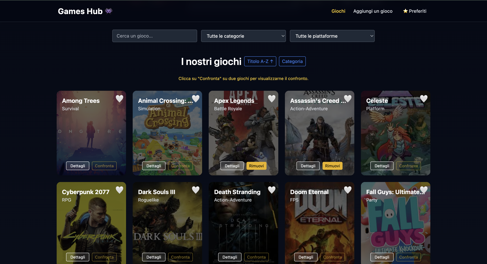
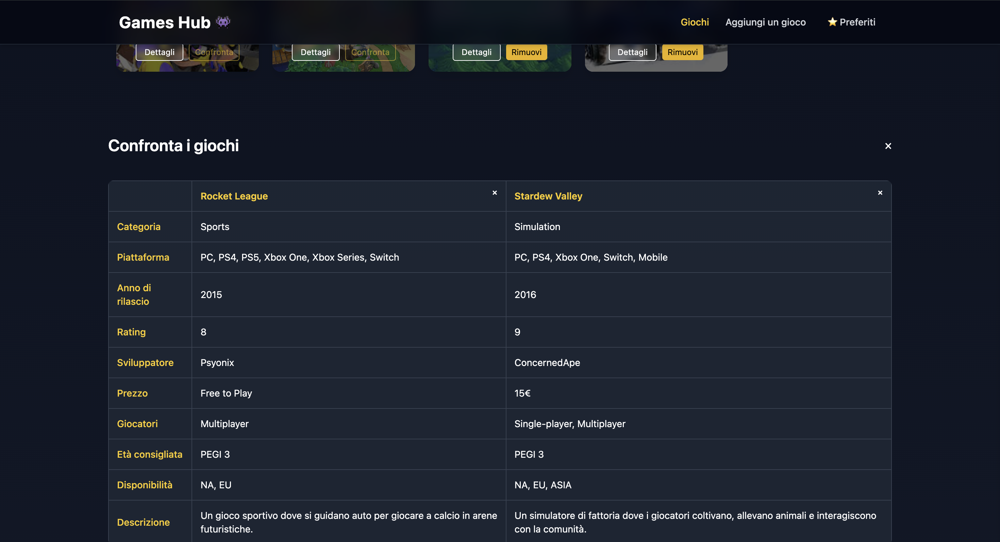
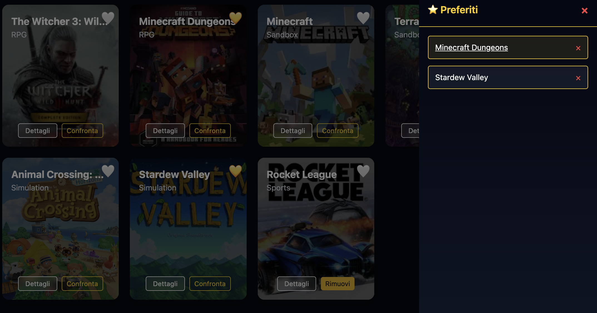
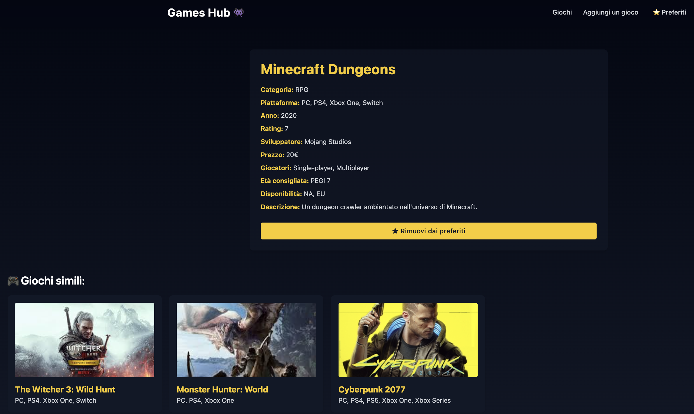
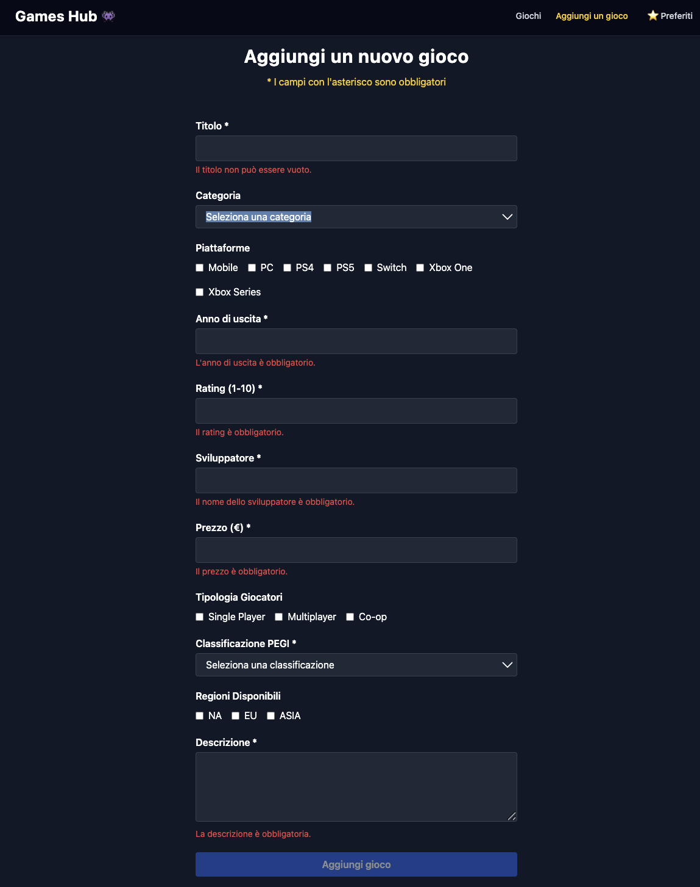

# Games Hub 👾

**Games Hub** è una Single Page Application (SPA) sviluppata con **React**, **TypeScript** e **TailwindCSS**, progettata per offrire un'esperienza utente intuitiva e fluida nella consultazione e gestione di un catalogo di videogiochi.  
L'applicazione consente di esplorare, cercare, filtrare, confrontare e salvare giochi preferiti, il tutto in un’interfaccia moderna e reattiva.

🔗 **Live Demo:** [games-hub-rho.vercel.app](https://games-hub-rho.vercel.app/)
---

## ✨ Caratteristiche principali

- **Ricerca e filtri dinamici** per titolo, categoria e piattaforma
- **Ordinamento alfabetico** per titolo e categoria
- **Pagina di dettaglio** con visualizzazione estesa delle informazioni del gioco
- **Sistema di preferiti** accessibile globalmente e persistente tramite localStorage
- **Comparatore di giochi** attivabile selezionando due elementi da confrontare
- **Carosello in homepage** per evidenziare i giochi con il rating più alto
- **Giochi suggeriti** nella pagina di dettaglio, basati sulla stessa categoria
- **Funzionalità di creazione ed eliminazione** giochi (CRUD parziale)
- **Gestione degli stati vuoti** 

---

## 🧑‍💻 Tecnologie utilizzate

- **React** – Architettura ottimizzata per componenti riutilizzabili
- **TypeScript** – Tipizzazione completa del progetto, inclusi `Game.ts` e `GlobalContextType.ts`
- **TailwindCSS** – Styling modulare
- **React Router DOM** – Gestione delle pagine tramite routing client-side
- **React Context API** – Gestione dello stato globale
- **LocalStorage** – Persistenza lato client dei preferiti

---

## 📦 Deploy e dati

Il progetto è completamente **statico** e non richiede un backend:  
i dati sono gestiti localmente tramite un file JS che simula un database, con relative tipizzazioni.

La demo è deployata su Vercel e accessibile al link:  
👉 [https://games-hub-rho.vercel.app/](https://games-hub-rho.vercel.app/)

---

## 📸 Screenshot
**Home con carosello giochi top-rated** 

**Gamelist**

**Comparatore attivo tra due giochi**

**Preferiti**

**Pagina di dettaglio con suggerimenti**

**Form per aggiungere un nuovo gioco**

    

*(Screenshots disponibili nella cartella `screens/`)*

---

## 📍 Obiettivo del progetto

Il progetto è nato come consegna finale per una specializzazione frontend, ma è stato **completamente riscritto da zero** in TypeScript con l'obiettivo di:

- Apprendere e consolidare l’uso di **TypeScript** in un contesto reale
- Sperimentare lo **stile utility-first** con **TailwindCSS**
- Progettare un’interfaccia completa senza backend, pronta per il deploy statico

---

## 👨🏻‍💻 Autore

**Luca**  
Jr. Frontend Developer  
[LinkedIn](https://www.linkedin.com/in/luca-conigliaro-5636b1352/) • [GitHub](https://github.com/lucaconigliaro)  